# ROF

출시 여부 : 심사중

- UI
    - Material를 활용해 직관적인 UI를 구현
      
- Tech
    - ViewModel를 활용하여 값 전달 유연하게 적용
    - LiveData를 활용하여 값의 변경여부를 수신하여 UI에서 업데이트
    - Remote Config를 활용하여 업데이트 및 버전 관리 관련 로직 구현
    - Crashlytics를 활용하여 비정상 앱종료, 버그 등 오류 관하여 실시간 모니터링 기능 구현
      
- 아쉬운점
    - /B 테스트 진행
    - 서버 DB와 오프라인 DB 사이의 동기화 기능 개발
    - 오프닝 광고를 구현했지만 활성화를 못하여 자료를 더 찾아보고 활성화하기

---

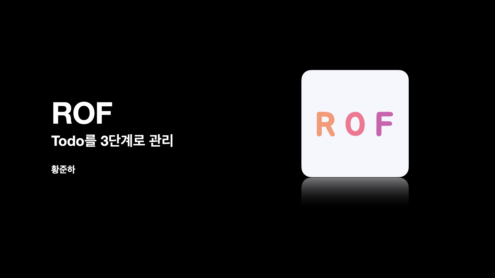

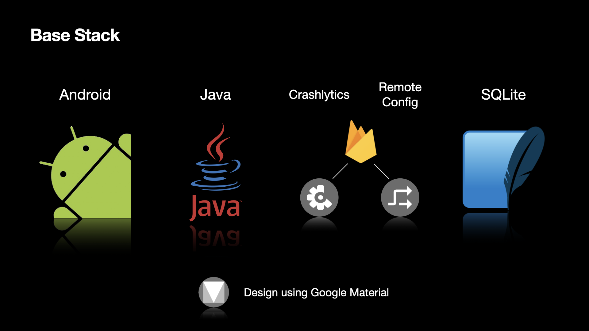

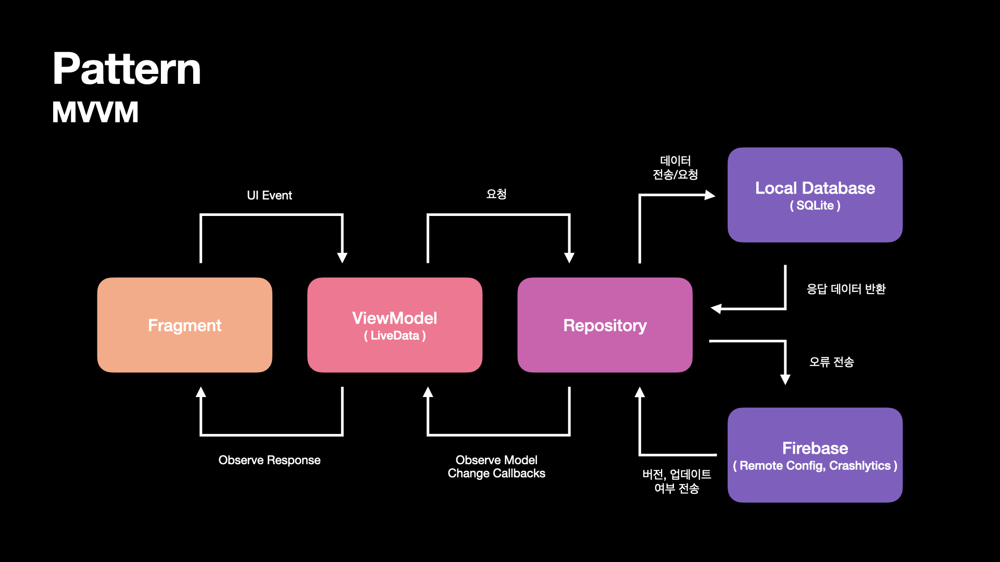

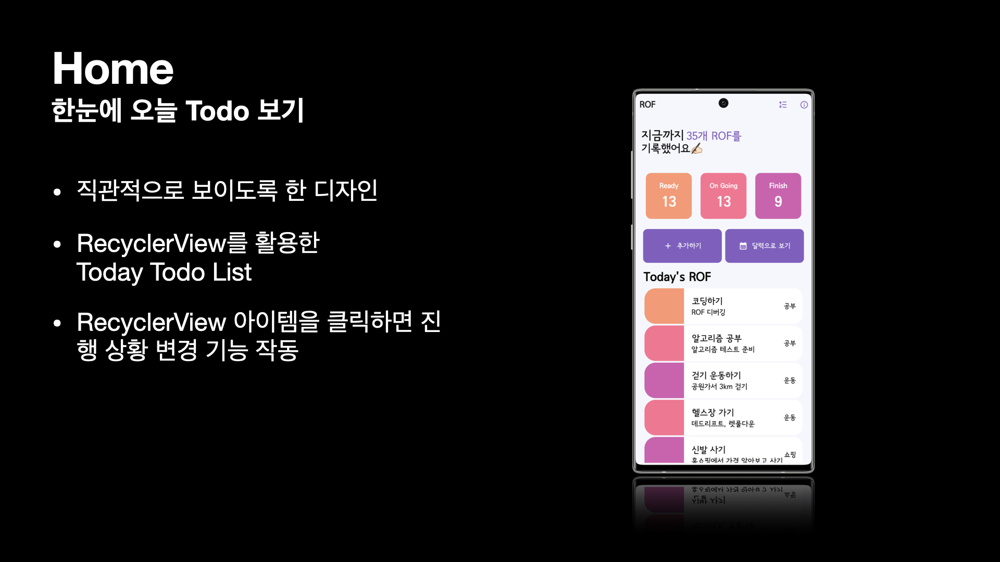

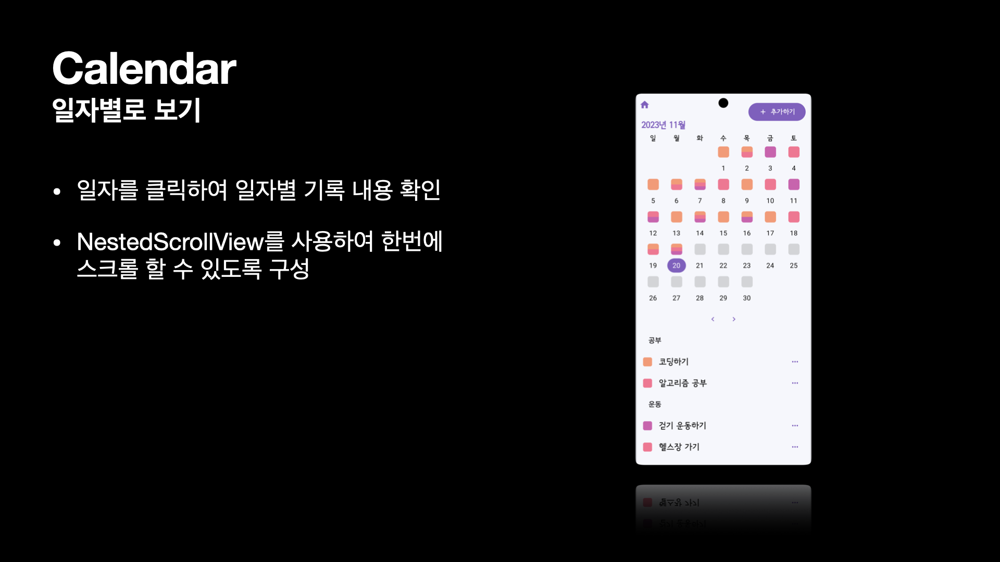

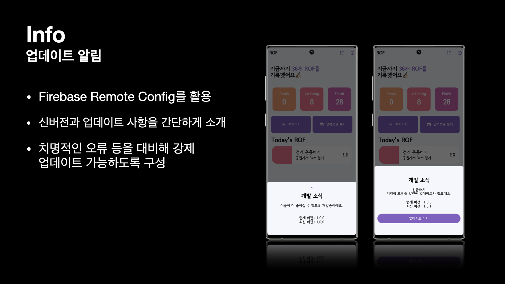

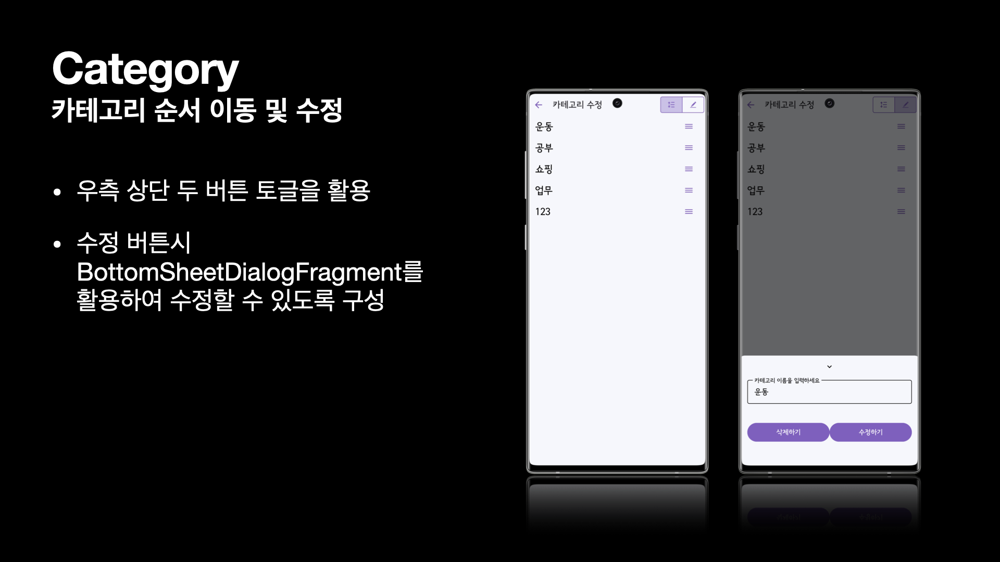

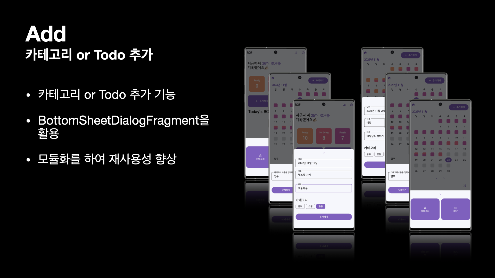

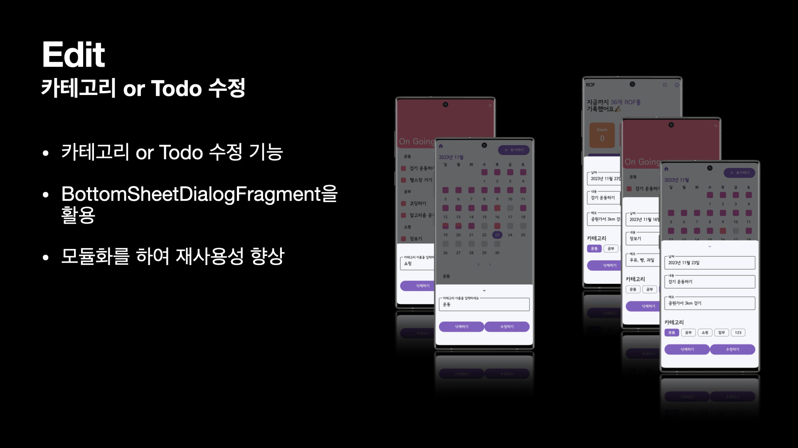

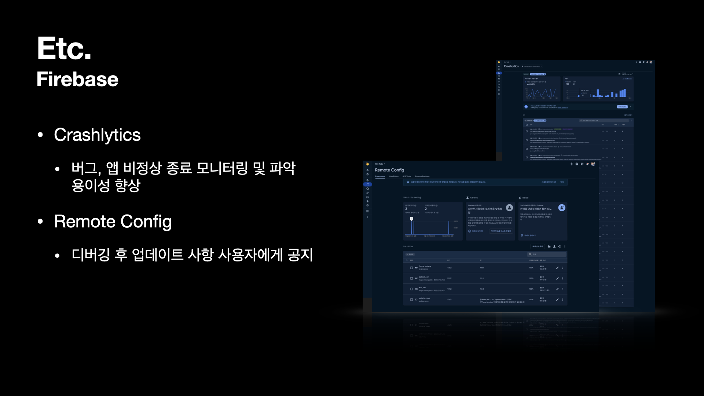

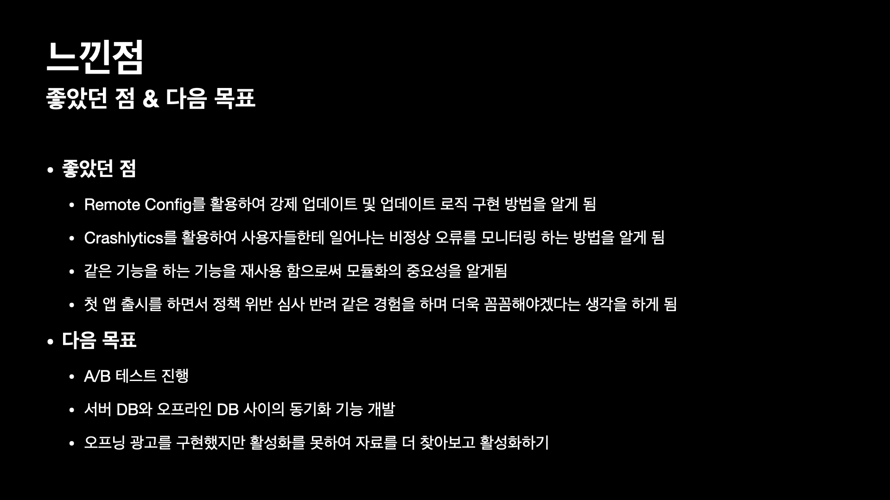

